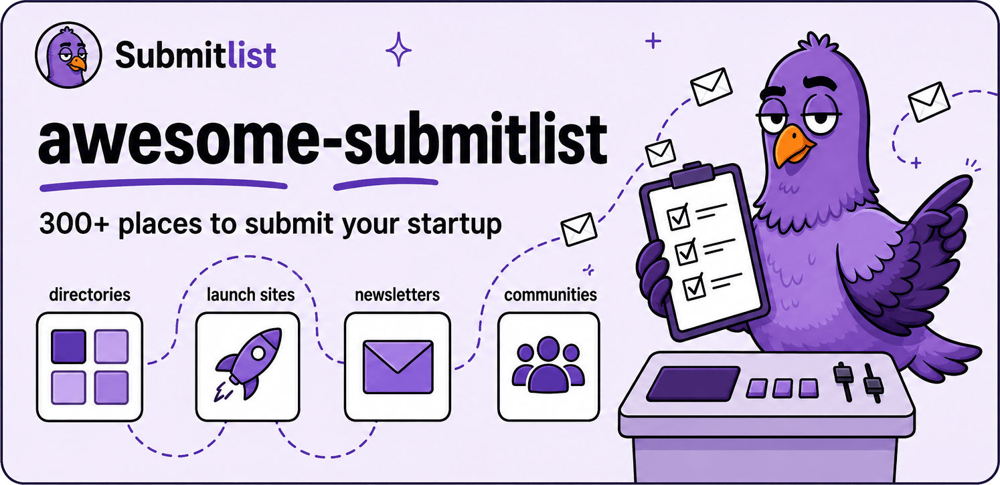

  

  
  
  
  
  

  <b><a href="https://submitlist.io">submitlist.io</a></b> · <a href="https://submitlist.io/catalog">Browse the catalog</a> · <a href="https://submitlist.io/guides">Guides</a> · <a href="#contributing">Suggest a site</a>

Every place a software product can be submitted, listed, launched, or mentioned, in one list. **334 destinations** across 7 kinds, each with the metrics you actually decide on: Domain Rating, monthly organic traffic, price, and whether the link you get back is dofollow.

The list is generated from the live [Submitlist catalog](https://submitlist.io/catalog), the same data behind the app that tracks your submissions on a kanban board. Entries are hand-verified before they go in, metrics are re-audited, and dead or parked sites get archived instead of rotting here. 105 destinations have a Domain Rating of 80 or higher, 202 are free, and 158 hand back a dofollow link.

## Contents

- [Directories](#directories) 118
- [Product launch sites](#product-launch-sites) 13
- [Newsletters](#newsletters) 37
- [Communities](#communities) 24
- [Subreddits](#subreddits) 44
- [Marketplaces](#marketplaces) 26
- [Citations](#citations) 72

- [How this list is built](#how-this-list-is-built)
- [Contributing](#contributing)

## How to read the tables

- **DR** is Domain Rating by [Ahrefs](https://ahrefs.com), 0 to 100. Higher means the site's own backlink profile is stronger, so a link from it carries more weight.
- **Traffic** is Ahrefs' estimate of monthly organic search visits to the whole site, not to your listing.
- **Pricing** is what the listing itself costs. Free sites often sell a faster review or a featured slot on top.
- **Link** says whether a listing's outbound link is dofollow or nofollow. Blank means it has not been checked yet.
- **Promotion** on subreddits is the route the moderators allow: a direct post, a recurring promotion thread, or comments only.
- Each table is sorted by DR (subreddits by members, newsletters by subscribers). Blank cells mean the data point is unknown, not zero.

##  Directories

118 entries · [browse with filters](https://submitlist.io/catalog?type=directory)

Curated listing sites. Most accept a URL, a short description, and a category. Sorted by Domain Rating, so the strongest links sit at the top.

| Site | What it is | DR | Traffic | Pricing | Link |
| --- | --- | :---: | :---: | :---: | :---: |
| [Stripe](https://docs.stripe.com/directory) | Stripe is a financial infrastructure and payments platform that also operates a public Directory of businesses built on or integrating with it. | 95 | 4.2M | Free | Nofollow |
| [Trustpilot](https://business.trustpilot.com/) | Open consumer-review platform where businesses claim profiles to display, collect, and respond to customer reviews. | 94 | 60M | Free | Nofollow |
| [Better Business Bureau](https://www.bbb.org/get-listed) | The Better Business Bureau operates a public directory of business profiles with ratings, complaint history, and reviews, plus a voluntary paid Accreditation program. | 93 | 3.5M | Free | Nofollow |
| [Psychology Today](https://member.psychologytoday.com/us/registration) | Mental-health publication and professional directory where people find therapists, psychiatrists, treatment centers, and support groups by location and specialty. | 93 | 6M | Paid |  |
| [Gartner Peer Insights](https://www.gartner.com/peer-insights/vendor-portal/overview) | Gartner is a research and advisory firm that runs Peer Insights, a platform for verified enterprise software and service reviews. | 92 | 1.6M | Free | Nofollow |
| [Capterra](https://app.g2digitalmarkets.com/get-listed/start) | B2B software discovery and review platform where vendors create product listings for in-market buyers. | 91 | 408K | Free | Dofollow |
| [Clutch](https://clutch.co/get-listed) | Clutch is a B2B ratings-and-reviews platform that lists and ranks professional service providers using verified client feedback. | 91 | 1.3M | Free | Nofollow |
| [CNET Download.com](https://download.cnet.com/add-your-software/) | CNET Download.com is CNET's software-distribution directory for apps and programs. | 91 | 1.2M | Free | Nofollow |
| [G2](https://g2.com) | G2 is a platform where buyers research business software and services using verified user reviews and product profiles. | 91 | 680K | Free | Nofollow |
| [Glassdoor](https://www.glassdoor.com/employers/sign-up/) | Glassdoor is a platform for company reviews, salary data, interview insights, and job listings contributed by employees and managed by employers. | 91 | 3.4M | Free | Nofollow |
| [Nextdoor](https://business.nextdoor.com/en-us/getting-started/business-page) | Nextdoor is a neighborhood social network where local businesses can claim or create Business Pages for discovery, recommendations, posts, and messaging. | 91 | 1.4M | Free | Dofollow |
| [ProvenExpert](https://www.provenexpert.com/en-us/register/) | ProvenExpert is a review and reputation platform where businesses and experts create profiles, collect customer reviews, and gain visibility through public listings. | 91 | 62K | Free | Dofollow |
| [Yellow Pages](https://www.yellowpages.com/claim-your-listing) | Yellow Pages is a business directory where owners can claim or create a basic business profile and manage its public details. | 90 | 1.2M | Free | Nofollow |
| [Awwwards](https://www.awwwards.com/submit/) | Awwwards is a web-design awards platform where live websites are submitted for staff review and jury or community evaluation. | 89 | 729K | Paid | Dofollow |
| [Software Advice](https://app.g2digitalmarkets.com/get-listed/start) | B2B software discovery platform where businesses compare software and vendors can establish product listings for in-market buyers. | 87 | 192K | Free | Nofollow |
| [Built In](https://knowledgebase.builtin.com/s/article/How-do-I-create-a-company-profile) | Built In is a technology employer-brand platform where companies create profiles, showcase workplace details, and post jobs. | 86 | 949K | Free | Nofollow |
| [GeekWire](https://www.geekwire.com/submit-startup/) | GeekWire maintains a startup database and ranking for eligible Pacific Northwest technology startups. | 86 | 96K | Free | Dofollow |
| [GoodFirms](https://www.goodfirms.co/get-listed) | GoodFirms is a B2B directory for software vendors and service companies with verified profiles, reviews, and category rankings. | 86 | 174K | Free | Nofollow |
| [Softonic](https://publishing-center.softonic.com/home) | Softonic is a software discovery and distribution catalog where developers can publish or manage application listings. | 86 | 62M | Free | Nofollow |
| [Softpedia](https://www.softpedia.com/user/submit.shtml) | Softpedia is a software download library where developers submit product listings for editorial selection and publication. | 86 | 235K | Free | Dofollow |
| [GetApp](https://getapp.com) | GetApp is a business software discovery platform with product profiles, reviews, and comparisons across software categories. | 85 | 60K | Free | Nofollow |
| [TrustRadius](https://solutions.trustradius.com/) | B2B technology review and buyer-intelligence platform where software vendors build product presence and customer-review programs. | 84 | 60K | Free | Dofollow |
| [F6S](https://www.f6s.com/) | F6S is a global startup platform where founders create company profiles and access funding programs, accelerators, software perks, and jobs. | 83 | 274K | Free | Dofollow |
| [Dang.ai](https://dang.ai/submit) | Dang.ai is a manually reviewed directory of AI tools and services. | 82 | 34K | Paid | Dofollow |
| [Sitejabber](https://www.smartcustomer.com/business) | Sitejabber is an online review platform where consumers rate businesses and companies manage public profiles and feedback. | 81 | 9K | Free | Nofollow |
| [AlternativeTo](https://alternativeto.net/manage-item/) | Crowdsourced software directory that recommends alternatives to apps you already know, across desktop, mobile, and web. | 80 | 114K | Free | Nofollow |
| [CSS Design Awards](https://www.cssdesignawards.com/submit) | CSS Design Awards is an international web design awards platform that recognizes outstanding websites through daily, monthly, and yearly judged awards. | 80 | 13K | Paid | Dofollow |
| [SaaSHub](https://www.saashub.com/services/submit) | Independent software marketplace for finding the best software and alternatives, helping software professionals since 2014. | 80 | 5.2K | Free | Nofollow |
| [Brownbook](https://www.brownbook.net/register/) | Brownbook is a free, editable global business listing database used for business discovery and local-search citations. | 79 | 3.5K | Free | Dofollow |
| [Comparably](https://www.comparably.com/company-tools) | Employer and company-profile platform combining verified employee reviews, workplace-culture ratings, salary data, company Q&A, employer-brand tools, recruiting content… | 79 | 149K | Free |  |
| [Index by Dodo Payments](https://index.dodopayments.com/submit) | Index by Dodo Payments is a directory of startups, indie-hacker projects, and SaaS tools for discovery, comparison, and visibility. | 79 | 3.6K | Free | Dofollow |
| [StackShare](https://stackshare.io) | Directory for discovering and comparing technology stacks, developer tools, and AI tools used by product teams. | 79 | 8.6K | Free | Dofollow |
| [SoftwareSuggest](https://www.softwaresuggest.com/vendors) | Business software directory with 50k+ products, expert reviews, comparisons, and free recommendations for buyers. | 78 | 113K | Free | Nofollow |
| [Technology Advice](https://solutions.technologyadvice.com/list-your-product/) | Technology Advice is a B2B technology and software reviews, insights, and marketplace platform that helps buyers evaluate products and connect with vendors. | 78 | 209K | Free | Nofollow |
| [ToolPilot.ai](https://www.toolpilot.ai/pages/submit-your-ai-tool) | ToolPilot.ai is a directory where users discover, compare, review, and explore AI tools and services. | 78 | 5.3K | Free | Dofollow |
| [Findstack](https://findstack.com/get-listed) | Findstack is a business-software comparison platform with product features, pricing, integrations, and aggregated user reviews across hundreds of categories. | 77 | 3.6K | Free | Nofollow |
| [TechBehemoths](https://techbehemoths.com/companies/get-listed) | Global directory of technology agencies and service companies searchable by location, service, industry, team size, hourly rate, and client focus. | 77 | 73K | Free |  |
| [There's An AI For That](https://theresanaiforthat.com/launch/) | The largest AI tools directory, tracking AI tools, models, and news in real time for millions of monthly visitors. | 77 | 1M | Paid | Dofollow |
| [e27](https://e27.co/startup/create/profile/) | e27 connects the Asian startup ecosystem through startup and investor profiles, news, events, contributor content, and networking tools. | 76 | 22K | Free | Dofollow |
| [Alternative.me](https://alternative.me/how-to/submit-software/) | Alternative.me is a platform for discovering and comparing software, apps, products, and their alternatives. | 75 | 107K | Free | Dofollow |
| [Cybo](https://support.cybo.com/hc/en-us/articles/8725672371469-How-do-I-Add-a-Business) | Cybo is a global business directory with listings across hundreds of countries and languages. | 75 | 519K | Free | Nofollow |
| [Gust](https://gust.helpscoutdocs.com/article/211-publishing-your-profile) | Gust is a global startup platform and network that helps companies incorporate, manage equity, and connect with investors, angel groups, and accelerators through… | 75 | 5.9K | Free | Dofollow |
| [SaaSworthy](https://saasworthy.com) | SaaSworthy is a software comparison and review platform that tracks software products across categories using an SW Score ranking system. | 75 | 19K | Free | Dofollow |
| [Crozdesk](https://vendor.revleads.com/user/signup) | Business software search platform that helps buyers find and compare software across all major categories with rankings, reviews, and pricing. | 74 | 60K | Free | Nofollow |
| [PeerSpot](https://company.peerspot.com/) | Enterprise technology marketplace and customer-intelligence platform where vendors influence B2B buyers through validated customer evidence. | 74 | 14K | Free | Nofollow |
| [SelectHub](https://pmo.selecthub.com/claim-your-product/) | SelectHub is a software selection and analyst research platform with product directories, comparisons, requirements tools, and vendor-buyer matching for business and… | 74 | 17K | Free | Dofollow |
| [What's the Big Data](https://whatsthebigdata.com/submit-new-ai-tool/) | What's the Big Data is an online destination for big-data, AI, and machine-learning news, guides, events, expert insights, and an AI-tools directory. | 74 | 95K | Free | Nofollow |
| [Landbook](https://land-book.com/submission-guidelines) | Landbook is a curated, daily updated gallery of hand-picked website designs for inspiration among creatives, designers, and marketers. | 73 | 14K | Free | Dofollow |
| [SoftwareWorld](https://www.softwareworld.co/) | SoftwareWorld is a review, ranking, and comparison platform that helps businesses discover and evaluate software products and service providers. | 73 | 15K | Free | Dofollow |
| [Built In Chicago](https://knowledgebase.builtin.com/s/article/How-do-I-claim-my-company-profile) | Built In Chicago is Built In's Chicago tech and startup vertical, with company profiles, job listings, local tech news, and employer-branding resources. | 72 | 80K | Free | Nofollow |
| [FeaturedCustomers](https://featuredcustomers.com/vendor-solutions) | FeaturedCustomers is a customer-reference platform for B2B software and services that aggregates authenticated testimonials, case studies, success stories, and videos… | 72 | 15K | Free | Nofollow |
| [Futurepedia](https://www.futurepedia.io/submit-tool) | One of the largest AI tool directories, showcasing the best AI tools, GPTs, and apps for professionals, updated daily. | 72 | 66K | Paid | Nofollow |
| [StartupBlink](https://www.startupblink.com/startups/add) | StartupBlink is a global startup-ecosystem research platform and interactive map that lists and ranks startups, ecosystems, and related entities for discovery… | 72 | 13K | Free | Nofollow |
| [Tekpon](https://tekpon.com/get-listed/) | Tekpon is a SaaS procurement and software marketplace that lists tools with profiles, comparisons, reviews, pricing transparency, and buyer-side procurement services. | 72 | 2.9K | Paid | Dofollow |
| [Toolify.ai](https://www.toolify.ai/submit) | Toolify.ai is an AI-tools directory that lists and categorizes AI products for discovery and traffic. | 72 | 54K | Paid | Nofollow |
| [AI Directories](https://www.aidirectori.es/submit-ai-tool) | AI Directories maintains a curated catalog of AI tools and directories, and offers a service for submitting tools to external directories. | 71 | 39K | Free | Dofollow |
| [Ecomm Design](https://ecomm.design/submit/) | Ecomm Design is a curated gallery of ecommerce website designs organized by vertical, platform, UX practice, and technology stack. | 71 | 51K | Free | Dofollow |
| [TrustMRR](https://trustmrr.com/dashboard) | TrustMRR is a verified startup-revenue database and acquisition marketplace for SaaS, apps, and digital businesses. | 71 | 11K | Free | Dofollow |
| [Future Tools](https://futuretools.io/submit-a-tool) | AI tool discovery directory and editorial site where users browse categorized tools, rankings, newly added products, and daily AI news. | 69 | 62K | Free | Nofollow |
| [OpenTools](https://opentools.ai/friends/launch-tool) | OpenTools is a discovery hub cataloging AI tools, models, MCP servers, experts, and resources for builders. | 69 | 14K | Paid | Dofollow |
| [SaaSPirate](https://saaspirate.com/submit-saas/) | SaaSPirate is a platform that curates and lists SaaS lifetime deals, discounts, and software for entrepreneurs and businesses. | 68 | 1.9K |  | Dofollow |
| [AI Tools](https://aitools.inc/submit) | AI-tool discovery directory organized by use case, task, job role, category, and pricing, with product profiles, educational material, and an associated AI-automation… | 67 | 23K | Free |  |
| [Jasmine Directory](https://www.jasminedirectory.com/index.php?a=2070753691) | Jasmine Directory is a human-curated web directory of businesses and websites with editorial review. | 67 | 4K | Paid | Dofollow |
| [OpenFuture AI](https://openfuture.ai/submit-tool) | OpenFuture AI is a large AI-tools aggregator and directory listing tens of thousands of tools across many categories with filters for discovery and comparison. | 67 | 420K |  | Nofollow |
| [Serchen](https://www.serchen.com/get-listed/) | Serchen is a business-software marketplace and review platform for discovering, comparing, and reviewing software applications. | 67 | 12K | Free | Dofollow |
| [CrowdReviews.com](https://www.crowdreviews.com/verify/get-started) | CrowdReviews.com is a community-driven platform that ranks software and services using user reviews and a transparent algorithm. | 66 | 3.7K | Free | Nofollow |
| [Sitelike.org](https://www.sitelike.org/add-site) | Sitelike.org is a free tool for finding similar websites and alternatives based on keywords, topics, audience, and popularity. | 66 | 8.8K | Free | Dofollow |
| [Web Design Inspiration](https://www.webdesign-inspiration.com/web-design-site/submit) | Web Design Inspiration is a curated gallery of handpicked website designs organized by type, style, color, and industry. | 66 | 3.9K | Free | Nofollow |
| [Startup Stash](https://startupstash.com/add-listing/) | One of the world's largest curated online directories of tools and resources for startups. | 65 | 20K |  | Dofollow |
| [TopAI.tools](https://topai.tools/submit) | TopAI.tools is an AI-tools directory indexing thousands of tools across more than 120 categories for search, comparison, and discovery. | 65 | 25K | Paid | Nofollow |
| [Landingfolio](https://landingfolio.com/submit) | Curated design gallery and component library showcasing high-quality landing pages, page sections, flows, and visual patterns for product and marketing inspiration. | 64 | 30K | Paid | Nofollow |
| [Tool Finder](https://toolfinder.com/advertise) | Tool Finder is a productivity-software discovery site with a curated tools database, comparisons, deals, YouTube content, and a newsletter. | 60 | 3.9K | Paid | Nofollow |
| [Easy With AI](https://easywithai.com/submit-tool/) | Easy With AI is a curated AI tools directory with more than 50 categories, focused on making AI tools and services discoverable. | 59 | 27K | Paid | Dofollow |
| [AI With Me](https://aiwith.me/submit/) | AI With Me is a directory of thousands of AI tools across categories including writing, image, code, marketing, and productivity. | 58 | 3.9K | Free | Dofollow |
| [AIxploria](https://www.aixploria.com/en/submit-ai-tool-or-feature-company/) | AIxploria is a large AI-tools directory organized by category with search, top-10 lists, and daily updates for discovering and comparing AI products. | 57 | 131K | Paid | Nofollow |
| [SaaSpo](https://saaspo.com/submit) | Curated collection of SaaS landing pages, interface sections, and web-design examples organized for visual product-design research. | 57 | 13K | Free |  |
| [Aitoolnet](https://www.aitoolnet.com/submit/) | Aitoolnet is a large AI tools directory and search engine that catalogs tens of thousands of curated AI tools by use case and category. | 56 | 2.1K | Free | Nofollow |
| [AITopTools](https://aitoptools.com/claim-your-tool/) | AITopTools is an AI-tools directory with curated tool listings, categories, new tools, and user reviews. | 54 | 27K | Paid | Nofollow |
| [Affiliate Watch](https://affiliate.watch/submit-affiliate-program) | Affiliate-program discovery directory with categorized program profiles, commission details, reviews, ratings, networks, software, and submission options for program… | 53 | 19K | Free |  |
| [Saas AI Tools](https://saasaitools.com/submit-listing-2/) | Saas AI Tools is a directory of generative AI and SaaS tools with daily AI news for founders and builders. | 53 | 3.5K | Free | Dofollow |
| [SaaS Landing Page](https://slpads.framer.website/contact) | Curated gallery of SaaS landing pages, product pages, pricing pages, onboarding screens, and other interface examples for design inspiration. | 53 | 30K | Paid |  |
| [AI Tools Directory](https://aitoolsdirectory.com/submit-tool) | AI Tools Directory is a curated directory of AI software and tools for entrepreneurs, creators, and innovators. | 52 | 26K | Free | Nofollow |
| [MaxiBestOf](https://maxibestof.one/submit) | Curated web-design inspiration directory featuring screenshots, typography, color palettes, industries, styles, and technology details from submitted websites. | 52 | 12K | Free |  |
| [Appvizer](https://help.appvizer.com/en/articles/how-do-i-reference-software-on-appvizer) | Appvizer is a B2B software comparison, catalog, and media platform that helps professionals discover, compare, and select SaaS and business tools across many categories… | 51 | 16K | Free | Dofollow |
| [Business-Software.com](https://www.business-software.com/add-your-product/) | Business-Software.com is a business software review, comparison, and directory site for technology buyers. | 51 | 9.1K | Free | Nofollow |
| [eBool](https://www.ebool.com/submit) | eBool is a product directory and index of software, business tools, and services across thousands of categories. | 51 | 1.7K | Free | Dofollow |
| [VentureRadar](https://www.ventureradar.com/add_company) | VentureRadar is a global innovative-company database used by corporations, investors, and partners to research companies. | 51 | 7.1K | Free | Dofollow |
| [AppAgg](https://appagg.com/add/) | AppAgg is an independent app aggregator that indexes apps and games from major mobile, desktop, and console stores for discovery, deals, rankings, and lists. | 50 | 3.8K | Free | Dofollow |
| [Tapscape](https://www.tapscape.com/submit-app-review/) | Technology publication offering professionally written reviews of iPhone, iPad, Mac, and Android applications with store, company, video, and social links. | 50 | 10K | Paid |  |
| [Cuspera](https://www.cuspera.com/vendors) | AI-assisted business software discovery directory where vendors can create profile pages and be recommended to buyers by use case. | 49 | 4.8K | Free | Nofollow |
| [Micro SaaS Examples](https://www.microsaasexamples.com/submit) | Curated directory of profitable micro-SaaS products and ideas, organized by category, audience, business model, and adjacent opportunities. | 49 | 1.8K | Paid |  |
| [Stork.AI](https://www.stork.ai/submit) | Stork.AI is an AI tools, agents, and MCP directory with multi-language listings and agent discoverability. | 48 | 21K | Free | Nofollow |
| [TOOOLS.design](https://www.toools.design/suggest-a-tool) | Curated directory of more than 2,200 design resources spanning AI, UI and UX, icons, illustrations, inspiration, typography, productivity, marketing, and web builders. | 47 | 6.9K | Free |  |
| [Altern](https://altern.ai/maker/submit/start) | Altern is a curated AI directory and marketplace for tools, agents, models, and APIs with a Maker submission path. | 46 | 1.5K | Free | Dofollow |
| [PublicAPIs.dev](https://github.com/marcelscruz/public-apis/blob/main/CONTRIBUTING.md) | Collaborative directory of publicly documented, self-serve APIs organized by category with authentication and CORS details for developers. | 45 | 4.4K | Free |  |
| [TipSeason](https://www.tipseason.com/ai-tools/submit-free) | TipSeason runs an AI-tools directory alongside prompts and courses. | 44 | 1.3K | Free | Dofollow |
| [Startup Buffer](https://startupbuffer.com/site/submit) | Startup Buffer is a public startup directory organized by market, location, tags, and related products, with founder-submitted profiles that go through review. | 43 | 2K | Free | Dofollow |
| [That AI Collection](https://thataicollection.com/submit/) | Multilingual discovery directory covering more than 4,000 AI applications across writing, design, development, marketing, audio, video, productivity, and other use cases. | 43 | 1K | Paid |  |
| [Appscribed](https://appscribed.com/submit-ai-tool/) | Appscribed is an AI tools directory with curated listings, hand-written editorial reviews, and comparisons. | 42 | 1.7K | Paid | Dofollow |
| [BestofAI](https://bestofai.com/) | BestofAI is a curated AI-tools directory with more than 15,000 products across more than 100 categories. | 42 | 5.8K | Free | Dofollow |
| [Dark](https://www.dark.design/auth/login) | Curated dark-website design gallery organized across agency, AI, culture, personal, software, web3, and other visual categories. | 42 | 1.7K | Free |  |
| [Tailkits](https://tailkits.com/submit-product/) | Curated Tailwind CSS marketplace and directory covering templates, UI kits, components, tools, generators, and production-ready design resources. | 42 | 10K | Free |  |
| [Dark Mode Design](https://www.darkmodedesign.com/) | Curated gallery of dark-mode websites and interface inspiration spanning product, portfolio, agency, ecommerce, editorial, and application design. | 40 | 1.3K | Free |  |
| [LLM Relevance](https://www.llmrelevance.com/submit) | AI and SEO tool directory for discovering software, comparing use cases, and browsing free tools for small-business marketing workflows. | 38 | 1K | Free |  |
| [Find My AI tool](https://findmyaitool.com/submit-tool) | Find My AI tool is a directory of more than 2,500 AI tools, GPTs, and agents organized by category, industry, and pricing model. | 37 | 12K | Paid | Dofollow |
| [AI Tools Explorer](https://aitoolsexplorer.com/submit-ai-tool/) | Curated AI-tool directory with human-written lifetime profile pages, category and feature filters, pricing information, target audiences, integrations, models, and… | 35 | 3.6K | Paid | Nofollow |
| [AI Parabellum](https://aiparabellum.com/submit-your-ai-tool/) | AI Parabellum is a paid, manually reviewed AI-tools directory that lists approved tools on a dedicated page. | 34 | 1.2K | Paid | Dofollow |
| [WhatTheAI](https://whattheai.tech/submit) | AI tool directory for discovering and comparing products across categories, platforms, pricing models, and use cases. | 34 | 22K | Free |  |
| [Powerusers AI](https://powerusers.ai/submit-ai-tool/) | Powerusers AI is a curated directory of AI tools for business owners and entrepreneurs, with filters, personal lists, and related guides. | 33 | 2.3K | Paid | Dofollow |
| [The Startup INC](https://thestartupinc.com/submit-startup/) | Startup listing website publishing company profiles for discovery by founders, customers, and investors. | 33 | 1.8K | Paid |  |
| [TopTools.ai](https://toptools.ai/submit) | AI tools directory organizing product profiles across thirty categories including agents, chatbots, design, marketing, research, coding, video, audio, and productivity. | 30 | 1.3K | Free |  |
| [The Startup Project](https://startupproject.org/submit-startup/) | Founder resource hub with a curated startup directory alongside free templates, tools, guides, learning paths, and investor resources. | 21 | 1K | Free |  |
| [AI-Hunter.io](https://ai-hunter.io/submit-a-tool/) | AI-tool discovery directory covering thousands of products across business, content, development, image, video, productivity, research, and other AI categories. | 20 | 1.4K | Free |  |
| [Lachief](https://tally.so/r/w4Jb4b) | AI tool directory for discovering software across writing, productivity, marketing, design, development, and other use cases. | 20 | 11K | Free |  |
| [The AI Navigator](https://www.theainavigator.com/submit-an-ai-tool) | The AI Navigator is an AI-tools guide and directory with reviewed listings. | 19 | 7.5K |  | Dofollow |
| [Startup Heroes](https://startupheroes.io/submit/startup/) | Manually reviewed startup directory with company profiles organized by industry, technology category, country, region, and founding year. | 14 | 1.1K | Paid |  |
| [ToolsPedia](https://toolspedia.io/submit-tool/) | AI tools directory with thousands of categorized product pages, discovery collections, browser-extension listings, and featured placements. | 13 | 1.4K | Paid |  |
| [BroUseAI](https://www.brouseai.com/submission/ai) | AI tool directory for discovering categorized products, featured tools, new releases, pricing models, use cases, and AI terminology. | 10 | 38K | Free | Dofollow |

<a href="#contents">back to contents ↑</a>

##  Product launch sites

13 entries · [browse with filters](https://submitlist.io/catalog?type=product-launch-site)

Launch-day platforms. Timing and the maker comment matter more than the form itself, so read each site's rules before you schedule.

| Site | What it is | DR | Traffic | Pricing | Link |
| --- | --- | :---: | :---: | :---: | :---: |
| [Product Hunt](https://www.producthunt.com/launch) | Daily launch platform where makers debut new products and reach early adopters, press, and investors. | 91 | 253K | Free | Nofollow |
| [Peerlist](https://peerlist.io/launchpad) | Professional network for builders to showcase work, launch projects, and connect with other technology professionals. | 77 | 85K | Free | Nofollow |
| [BetaList](https://betalist.com/submit) | Curated showcase of upcoming internet startups where early adopters discover and get early access to new products before launch. | 76 | 18K | Paid | Dofollow |
| [Uneed](https://www.uneed.best/submit-a-tool) | Uneed is a curated social launchpad and product-discovery directory where makers launch technology products for daily homepage exposure, community upvoting, and rankings. | 75 | 7.9K | Paid | Dofollow |
| [Webrazzi](https://webrazzi.com/en/startup-form/) | Technology publication covering startups, digital business, investments, acquisitions, mobile products, and internet companies, with a strong Turkish audience. | 74 | 16K | Free |  |
| [PeerPush](https://peerpush.com/) | PeerPush is a community-driven product-launch and discovery platform with structured product listings, rankings, and permanent listing pages. | 73 | 6K | Free | Dofollow |
| [TinyLaunch](https://www.tinylaunch.com/) | TinyLaunch is a product-launch platform for indie projects and startups that offers community voting, badges, and backlinks. | 73 | 1.9K | Free | Dofollow |
| [Aura++](https://auraplusplus.com/projects/submit) | Aura++ is a product-launch platform where founders schedule daily launches, collect community upvotes, and receive SEO assets such as structured pages, backlinks, and… | 72 | 5.3K | Free | Dofollow |
| [OpenHunts](https://openhunts.com/projects/submit) | OpenHunts is a product launch and discovery platform positioned as an open alternative to Product Hunt for makers and startups. | 70 | 4.9K | Free | Dofollow |
| [PitchWall](https://pitchwall.co/submit) | PitchWall showcases selected startups and digital technology products for discovery and visibility. | 68 | 15K | Free | Dofollow |
| [DevHunt](https://devhunt.org/) | DevHunt is an open-source, community-driven Product Hunt-style launchpad focused exclusively on developer tools. | 63 | 14K | Free | Dofollow |
| [Startup Ranking](https://www.startupranking.com/startup/create) | Startup Ranking is a platform that discovers and ranks startups worldwide using an SR Score based on web importance and social influence, with country and state rankings. | 62 | 11K | Free | Dofollow |
| [Launch Vault](https://www.launchvault.dev/projects/submit) | Curated daily product-launch platform where makers publish technology products, receive votes, and compete for discovery placements. | 55 | 1.1K | Paid |  |

<a href="#contents">back to contents ↑</a>

##  Newsletters

37 entries · [browse with filters](https://submitlist.io/catalog?type=newsletter)

Maker and startup inboxes that feature products. Reader counts and open rates come from the newsletter's own public stats. There is rarely a form. Write to the editor.

| Newsletter | What it covers | Subscribers | Open rate | Platform |
| --- | --- | :---: | :---: | :---: |
| [Morning Brew](https://morningbrew.com) | Morning Brew is a daily email newsletter delivering concise updates on global business, finance, and technology news with a conversational, humorous tone. | 4M | 42% |  |
| [1440](https://join1440.com) | 1440 is a daily news digest that curates fact-driven, unbiased news briefs across politics, business, science, and culture without opinion or clickbait. | 3.5M | 45% | beehiiv |
| [TLDR](https://tldr.tech) | TLDR is a daily email newsletter providing concise summaries of key developments across startups, technology, and programming. | 1.3M | 52% | beehiiv |
| [CB Insights](https://cbinsights.com) | The CB Insights Newsletter provides data-driven rundowns on emerging tech trends, venture capital funding, and private company markets. | 800K | 35% |  |
| [Sahil Bloom's Newsletter](https://sahilbloom.com) | The Curiosity Chronicle is a newsletter by Sahil Bloom that delivers actionable ideas and deep dives focused on personal growth, health, wealth, and living better. | 700K | 45% | beehiiv |
| [Lenny's Newsletter](https://lennysnewsletter.com) | Lenny's Newsletter is an advice column by Lenny Rachitsky offering researched insights on product development, growth strategy, and career progression. | 650K | 45% | Substack |
| [The Daily Upside](https://thedailyupside.com) | The Daily Upside is a modern business media brand and daily newsletter delivering news, market analysis, and insights on finance, economics, and global markets. | 550K | 45% | beehiiv |
| [The Pragmatic Engineer](https://pragmaticengineer.com) | The Pragmatic Engineer is a publication authored by Gergely Orosz offering inside coverage of software engineering practices, startups, and big tech companies. | 550K | 48% | Substack |
| [Alex Hormozi's Newsletter](https://acquisition.com) | Alex Hormozi's newsletter, The Mozi Money Minute, delivers brief, actionable business strategies and tools designed to boost company revenue. | 500K | 42% | beehiiv |
| [ByteByteGo](https://blog.bytebytego.com) | ByteByteGo is a newsletter that breaks down complex software architecture and distributed system design concepts into accessible explanations. | 500K | 42% | Substack |
| [The Information](https://theinformation.com) | The Information is a digital news publication delivering original, deeply reported coverage of the technology and business sectors. | 400K | 45% |  |
| [Not Boring](https://notboring.co) | Not Boring is a newsletter by Packy McCormick offering in-depth analyses of business models, tech trends, and ambitious startup stories. | 225K | 48% | Substack |
| [TLDR Web Dev](https://tldr.tech/webdev) | TLDR Web Dev is a focused edition of TLDR covering software development, web technologies, and practical programming news. | 220K | 48% | beehiiv |
| [Workweek](https://workweek.com) | Workweek is a business media network of creator-experts delivering industry-focused newsletters, podcasts, and digital content. | 200K | 45% | beehiiv |
| [Exec Sum](https://execsum.co) | Exec Sum is a daily newsletter curating financial market news, corporate trends, and tech industry updates from Wall Street to Silicon Valley. | 180K | 48% | beehiiv |
| [TLDR Design](https://tldr.tech/design) | TLDR Design is a TLDR edition covering product design, user experience, and the tools and ideas relevant to modern designers. | 180K | 48% | beehiiv |
| [Benedict's Newsletter](https://www.ben-evans.com/newsletter) | Benedict's Newsletter is Benedict Evans's analysis of technology, consumer products, and the long-term changes affecting the industry. | 175K | 42% | Substack |
| [Stratechery](https://stratechery.com) | Stratechery is a publication by Ben Thompson providing analysis on the business, strategy, and societal impact of technology and media. | 150K | 55% |  |
| [TLDR Founders](https://tldr.tech/founders) | TLDR Founders is a TLDR edition focused on startup companies, entrepreneurship, and the decisions involved in building a business. | 150K | 48% | beehiiv |
| [Platformer](https://platformer.news) | Platformer is Casey Newton's newsletter about the intersection of technology, policy, and society, with a focus on the platforms shaping public life. | 120K | 48% | Substack |
| [TLDR Marketing](https://tldr.tech/marketing) | TLDR Marketing is a TLDR edition covering growth, customer acquisition, marketing strategy, and the tools used by modern teams. | 120K | 48% | beehiiv |
| [The Profile](https://www.readtheprofile.com/) | The Profile is a weekly newsletter and media publication authored by Polina Pompliano featuring in-depth profiles of extraordinary founders, investors, executives, and… | 110K | 50% | Substack |
| [Demand Curve](https://demandcurve.com) | Demand Curve is a growth education and resources company whose newsletter shares acquisition, marketing, and startup growth tactics. | 95K | 42% |  |
| [Pat Walls' Starter Story](https://starterstory.com) | Starter Story is a publication and community sharing interviews and lessons from entrepreneurs who have built businesses. | 85K | 45% | Kit |
| [The Generalist](https://generalist.com) | The Generalist is a publication by Mario Gabriele delivering deep dives on startups, technology, business, and ambitious companies. | 85K | 45% | Substack |
| [The Diff](https://diff.substack.com) | The Diff is a newsletter by Byrne Hobart covering technology, business, markets, and the ideas shaping startups. | 65K | 50% | Substack |
| [Hacker Newsletter](https://hackernewsletter.com) | Hacker Newsletter is a curated newsletter highlighting notable links and stories for people interested in software and technology. | 60K | 45% | Mailchimp |
| [Jay Clouse's Creator Science](https://creatorscience.com) | Creator Science is Jay Clouse's newsletter about building a sustainable creator business through strategy, experimentation, and audience development. | 55K | 50% | Kit |
| [Newcomer](https://newcomer.co) | Newcomer is a newsletter covering venture capital, startups, and the people and firms shaping the technology industry. | 55K | 48% | Substack |
| [Sidebar](https://sidebar.io) | Sidebar is a daily newsletter curating noteworthy links and reading across technology, design, and the wider web. | 50K | 45% | Ghost |
| [Nathan Barry's Newsletter](https://nathanbarry.com) | Nathan Barry's Newsletter shares Nathan Barry's writing on entrepreneurship, creator businesses, marketing, and building products. | 45K | 48% | Kit |
| [SparkToro Office Hours](https://sparktoro.com/blog) | SparkToro Office Hours is a newsletter and content series from SparkToro covering audience research, marketing, and growth strategy. | 45K | 48% | Kit |
| [Dense Discovery](https://densediscovery.com) | Dense Discovery is a weekly newsletter featuring thoughtful recommendations across design, technology, culture, and digital products. | 42K | 48% | Ghost |
| [Growth in Reverse](https://growthinreverse.com) | Growth in Reverse analyzes how successful companies and creators grew, turning their public histories into practical growth lessons. | 42K | 48% | beehiiv |
| [Software Lead Weekly](https://softwareleadweekly.com) | Software Lead Weekly is a curated newsletter of software engineering articles, tools, and ideas for people leading technical teams. | 38K | 42% | Kit |
| [Pointer](https://pointer.io) | Pointer is a newsletter curating useful articles, tools, and ideas for software developers and technology practitioners. | 35K | 40% | Buttondown |
| [The Rebooting](https://therebooting.com) | The Rebooting is a publication and podcast by Brian Morrissey exploring the business models, audience strategy, and reinvention of modern media. | 35K | 48% | Ghost |

<a href="#contents">back to contents ↑</a>

##  Communities

24 entries · [browse with filters](https://submitlist.io/catalog?type=community)

Forums and groups where posting your product is welcome when you follow the house rules. Lurk first.

| Site | What it is | DR | Traffic | Pricing | Link |
| --- | --- | :---: | :---: | :---: | :---: |
| [GitHub Topics](https://docs.github.com/en/repositories/managing-your-repositorys-settings-and-features/customizing-your-repository/classifying-your-repository-with-topics) | GitHub's public topic system groups repositories by technology, subject, industry, and community-defined interests to support project discovery. | 97 | 46M | Free |  |
| [Pinterest](https://help.pinterest.com/en/business/article/get-a-business-account) | Pinterest is a visual discovery and social platform where users save and share ideas via Pins and boards. | 97 | 550M | Free | Nofollow |
| [Behance](https://www.behance.net) | Adobe-owned platform where creatives and companies showcase portfolios of design, illustration, photography, motion, and related work for discovery, feedback, and… | 94 | 3.6M | Free | Nofollow |
| [Dribbble](https://dribbble.com) | Design community and marketplace where designers and teams share work as "Shots", gain visibility, offer services, and connect with clients for projects. | 93 | 2.6M | Free | Nofollow |
| [Quora](https://www.quora.com/business/create) | Quora is a question-and-answer platform where users discuss topics and businesses can create official profiles to participate under their brand name. | 92 | 78M | Free | Nofollow |
| [SourceForge](https://sourceforge.net/p/add_project) | Open-source software forge and directory for hosting projects, distributing releases, and building project communities. | 92 | 2.8M | Free | Dofollow |
| [Hugging Face](https://huggingface.co/new-space) | AI community and hub for publishing models, datasets, and interactive AI applications as Spaces. | 91 | 1.5M | Free | Nofollow |
| [freeCodeCamp Forum](https://forum.freecodecamp.org/c/project-feedback/409) | freeCodeCamp's public developer forum for programming help, technical discussion, open-source contribution, career support, and constructive project showcases. | 89 | 66K | Free | Nofollow |
| [Open Collective](https://opencollective.com/create) | Open Collective is a transparent funding platform where groups and projects, including open-source software, create Collectives to raise, manage, and spend money. | 89 | 9.8K | Free | Nofollow |
| [Devpost](https://devpost.com/software/new?flow%5Bname%5D=add_software&ref_feature=built-with&ref_medium=button) | Hackathon and software-project community where makers publish project profiles and competition submissions. | 88 | 113K | Free | Nofollow |
| [SitePoint Forums](https://www.sitepoint.com/community/signup) | Long-running web-development forum covering programming, HTML and CSS, JavaScript, WordPress, design, business, hosting, and general developer questions. | 86 | 86K | Free | Dofollow |
| [Hashnode](https://hashnode.com/login) | Developer-focused blogging community where individuals and teams publish technical articles, follow writers, discuss posts, and distribute content through the Hashnode… | 83 | 51K | Free | Dofollow |
| [Techstars](https://apply.techstars.com/) | Techstars is a global startup accelerator and founder network that invests in early-stage companies and provides mentorship and investor connections. | 82 | 21K | Free | Dofollow |
| [Indie Hackers](https://www.indiehackers.com/products) | Indie Hackers is a community where independent founders and makers share milestones, strategies, and products for building online businesses. | 81 | 126K | Free | Nofollow |
| [BiggerPockets](https://www.biggerpockets.com/signup) | Real-estate investing community with public forums, member profiles, educational articles, podcasts, tools, events, and property-related discussions. | 80 | 54K | Free |  |
| [Designspiration](https://www.designspiration.com/) | Visual discovery community for collecting and publishing design inspiration, colors, links, notes, screenshots, and uploaded creative work. | 78 | 35K | Free |  |
| [Startup Grind](https://startup.startupgrind.com/apply/) | Global startup community operating local chapters, founder events, a vetted startup membership, investor introductions, and startup resources. | 76 | 17K | Free |  |
| [Product School Community](https://productschool.com/slack-community/) | Product School's Slack community for product managers to network, discuss product work, find answers, share knowledge, and discover industry opportunities. | 74 | 55K | Free |  |
| [Fark](https://www.fark.com/submit/) | Community-curated news and entertainment aggregator where registered members submit noteworthy links for editorial selection and discussion. | 73 | 18K | Free | Nofollow |
| [CoFoundersLab](https://cofounderslab.com/) | CoFoundersLab is an online networking community that connects entrepreneurs with potential cofounders, advisors, and investors through profiles and matching tools. | 62 | 2.3K | Free | Nofollow |
| [WIP](https://wip.co/projects) | WIP is an accountability community where members publish daily shipped progress and organize it into public projects. | 56 | 1.3K | Paid | Dofollow |
| [The Hive Index](https://thehiveindex.com/submit/) | The Hive Index is a directory of online communities organized by topic, platform, and features. | 51 | 17K | Free | Dofollow |
| [Unita](https://unita.co/add-community/) | Unita is a directory for discovering, comparing, and reviewing online communities and groups. | 47 | 4K | Free | Dofollow |
| [AppLauncher](https://www.applauncher.io/auth/register) | Product-launch platform and launch feed for indie developers and startups, with listing, brand-kit, SEO, audience, analytics, and multi-directory submission tools. | 14 | 6.7K | Free |  |

<a href="#contents">back to contents ↑</a>

##  Subreddits

44 entries · [browse with filters](https://submitlist.io/catalog?type=subreddit)

Niche reddit audiences. Every row carries the promotion route the moderators allow. "Unknown" means the rules do not say, so ask before you post.

| Subreddit | About | Members | 30d growth | Promotion |
| --- | --- | :---: | :---: | :---: |
| [r/webdev](https://www.reddit.com/r/webdev/submit) | A community dedicated to all things web development: both front-end and back-end. For more design-related questions, try /r/web_design. | 3.3M | +0.4% | Promotion thread |
| [r/javascript](https://www.reddit.com/r/javascript/submit) | Chat about javascript and javascript related projects. Yes, typescript counts. Please keep self promotion to a minimum/reasonable level. | 2.5M | +0.1% | Direct post |
| [r/Python](https://www.reddit.com/r/Python/submit) | The largest Python community for Reddit! Stay up to date with the latest news, packages, and meta information relating to the Python programming language. | 1.5M | +0.5% | Promotion thread |
| [r/selfhosted](https://www.reddit.com/r/selfhosted/submit) | A place to share, discuss, discover, assist with, gain assistance for, and critique self-hosted alternatives to our favorite web apps, web services, and online tools. | 829K | +2.6% | Comments only |
| [r/SaaS](https://www.reddit.com/r/SaaS/submit) | Discussions and useful links for SaaS owners, online business owners, and more. | 791K | +3.6% | Direct post |
| [r/IndieGaming](https://www.reddit.com/r/IndieGaming/submit) | A place for indie games | 519K | +2.0% | Direct post |
| [r/reactjs](https://www.reddit.com/r/reactjs/submit) | A community for discussing anything related to the React UI framework and its ecosystem. | 513K | +0.5% | Comments only |
| [r/Business_Ideas](https://www.reddit.com/r/Business_Ideas/submit) | Share and explore innovative business ideas, gain insights on initiating your venture, unravel the intricacies of 'Cost of Sale' (CoS), and decode the essentials of… | 470K | +1.5% | Promotion thread |
| [r/opensource](https://www.reddit.com/r/opensource/submit) | A subreddit for everything open source related (for this context, we go off the definition of open source here http://en.wikipedia.org/wiki/Open_source) | 378K | +2.0% | Direct post |
| [r/indiegames](https://www.reddit.com/r/indiegames/submit) | Anything related to indie games | 331K | +2.2% | Direct post |
| [r/microsaas](https://www.reddit.com/r/microsaas/submit) | A place to change your life with micro SaaS apps | 212K | +3.0% | Direct post |
| [r/iOSProgramming](https://www.reddit.com/r/iOSProgramming/submit) | A subreddit to discuss, share articles, code samples, open source projects and anything else related to iOS, macOS, watchOS, tvOS, or visionOS development. | 205K | +1.1% | Direct post |
| [r/indiehackers](https://www.reddit.com/r/indiehackers/submit) | IndieHackers is a subreddit focused on people who bootstrap their way to success by building products. | 190K | +3.0% | Direct post |
| [r/FlutterDev](https://www.reddit.com/r/FlutterDev/submit) | A community for the publishing of news and discussion about Flutter. | 182K | +0.8% | Direct post |
| [r/nextjs](https://www.reddit.com/r/nextjs/submit) | Next.js is a React framework for building full-stack web applications | 174K | +1.1% | Promotion thread |
| [r/AppBusiness](https://www.reddit.com/r/AppBusiness/submit) | A community for app founders, indie hackers, developers, and marketers building, launching, and growing app businesses. | 142K | +4.5% | Promotion thread |
| [r/nocode](https://www.reddit.com/r/nocode/submit) | No-Code Community dedicated to building cool things without needing to be a developer. | 137K | +2.5% | Post or thread |
| [r/vuejs](https://www.reddit.com/r/vuejs/submit) | Vue.js is a library for building interactive web interfaces. It provides data-reactive components with a simple and flexible API. | 135K | +0.5% | Direct post |
| [r/iosapps](https://www.reddit.com/r/iosapps/submit) | r/iOSApps is a one stop shop for all things related to iOS apps - featuring app showcases, reviews, news, updates, sales, developers, discounts and even freebies. | 122K | +4.4% | Post or thread |
| [r/buildinpublic](https://www.reddit.com/r/buildinpublic/submit) | A community for creators, developers, entrepreneurs, and makers to openly share their journey as they build projects in public. | 115K | +3.8% | Direct post |
| [r/AppIdeas](https://www.reddit.com/r/AppIdeas/submit) | Welcome! This subreddit is designed to be a professional environment where developers, entrepreneurs, and creators can come together to share their amazing app ideas. | 101K | +2.4% | Prohibited |
| [r/seogrowth](https://www.reddit.com/r/seogrowth/submit) | Subreddit dedicated to growing blogs, websites, and businesses via SEO. Home to the best tips, tricks, case studies and more! Not sure where to start? | 80K | +5.7% | Direct post |
| [r/ProductHunters](https://www.reddit.com/r/ProductHunters/submit) | Discussions about products on Product Hunt | 60K | +6.0% | Direct post |
| [r/sideprojects](https://www.reddit.com/r/sideprojects/submit) | A community to share and discuss side projects. | 50K | +12% | Direct post |
| [r/alphaandbetausers](https://www.reddit.com/r/alphaandbetausers/submit) | Our innovators need people to use their products to give them feedback! It is hard enough to develop a product. | 43K | +8.0% | Unknown |
| [r/StartupSoloFounder](https://www.reddit.com/r/StartupSoloFounder/submit) | Welcome to the home for solo founders building startups from scratch This community is for those going all in; coding, designing, marketing, validating, and scaling… | 40K | +14% | Direct post |
| [r/SaaSMarketing](https://www.reddit.com/r/SaaSMarketing/submit) | A community dedicated to sharing and discussing all aspects of SaaS marketing, from super tactical stuff all the way up to overarching strategy. | 35K | +5.1% | Direct post |
| [r/AppGiveaway](https://www.reddit.com/r/AppGiveaway/submit) | Get paid apps for free daily. IOS &amp; Android apps &amp; games for free. AppsGoneFree | 32K | +5.5% | Direct post |
| [r/TestMyApp](https://www.reddit.com/r/TestMyApp/submit) | Helping developers since 2015 TMA Discord: https://discord.gg/9wGENxCZrN Donate to my coffee fund if you found this sub useful :) Only if you can afford it!! | 29K | +6.2% | Direct post |
| [r/B2BSaaS](https://www.reddit.com/r/B2BSaaS/submit) | This subreddit is directed at anyone involved in a B2B SaaS business. | 29K | +6.9% | Direct post |
| [r/notioncreations](https://www.reddit.com/r/notioncreations/submit) | A subreddit to share your Notion templates, dashboards, and creations. Please add a link to your template. | 24K | +3.7% | Direct post |
| [r/BusinessDeconstructed](https://www.reddit.com/r/BusinessDeconstructed/submit) | Business Deconstructed is for entrepreneurs and anyone interested in learning the how behind building and growing a business. | 22K | +7.7% | Direct post |
| [r/StartupDACH](https://www.reddit.com/r/StartupDACH/submit) | Willkommen in der größten deutschsprachigen Startup-Community! | 20K | +7.6% | Direct post |
| [r/startupaccelerator](https://www.reddit.com/r/startupaccelerator/submit) | Helping startups to accelerate - startupaccelerator.dev | 18K | +8.4% | Direct post |
| [r/Startups_EU](https://www.reddit.com/r/Startups_EU/submit) | Space for any-size startups, and side-projects made in Europe! 🇪🇺 This subreddit is highly moderated to keep it clean and SPAM-free. | 17K | +5.5% | Direct post |
| [r/betatests](https://www.reddit.com/r/betatests/submit) | 🚀 New beta opportunities daily! ✅ Makers: post your product and get real feedback. All types welcome. 💬 Join our Discord using the button below 👇 | 17K | +6.7% | Direct post |
| [r/ShowYourApp](https://www.reddit.com/r/ShowYourApp/submit) | Welcome to r/ShowYourApp 🚀- A community for indie makers, developers, and founders to share their apps, web apps, SaaS, or software projects. | 16K | +11% | Direct post |
| [r/MobileAppDevelopers](https://www.reddit.com/r/MobileAppDevelopers/submit) | Welcome to r/MobileAppDevelopers – a community for developers, designers, and entrepreneurs passionate about building and growing mobile apps. | 16K | +0.6% | Direct post |
| [r/droidappshowcase](https://www.reddit.com/r/droidappshowcase/submit) | The premier showcase for Android developers to share apps and users to find exclusive deals and promo codes. | 14K | +16% | Direct post |
| [r/SaaSSolopreneurs](https://www.reddit.com/r/SaaSSolopreneurs/submit) | If you are not a software developer, but have a problem that you think could be solved with software, post about it in SaaSSolopreneurs, and good tings will happen✨ For… | 14K | +15% | Direct post |
| [r/ContentRich](https://www.reddit.com/r/ContentRich/submit) | Get rich making content UGC Platform Bounty CODE to get approved fast : 0I5PPIH3 | 11K | +5.5% | Restricted |
| [r/promoteMyApp](https://www.reddit.com/r/promoteMyApp/submit) | This is an Open community where you can freely promote your SaaS, Website, and mobile apps. We believe every builder should have a fair chance to promote their craft. | 9.3K | +36% | Direct post |
| [r/gameDevMarketing](https://www.reddit.com/r/gameDevMarketing/submit) | This subreddit encompasses all aspects of game development marketing and serves as a sister community to r/gameDev. | 9.2K | +17% | Direct post |
| [r/LaunchMyStartup](https://www.reddit.com/r/LaunchMyStartup/submit) | Welcome to LaunchMyStartup! This is where founders launch their cool new projects and get real feedback from other builders. | 8.4K | +2.4% | Direct post |

<a href="#contents">back to contents ↑</a>

##  Marketplaces

26 entries · [browse with filters](https://submitlist.io/catalog?type=marketplace)

App, extension, and plugin stores. Listing here is a distribution channel in its own right, and the developer accounts are often paid.

| Site | What it is | DR | Traffic | Pricing | Link |
| --- | --- | :---: | :---: | :---: | :---: |
| [Google Workspace Marketplace](https://developers.google.com/workspace/marketplace/how-to-publish) | Google's marketplace for add-ons, Chat apps, Drive apps, Classroom integrations, and web applications that extend Google Workspace. | 100 | 13M | Free | Dofollow |
| [Chrome Web Store](https://chrome.google.com/webstore/devconsole) | Google's official online marketplace where users discover, install, and manage Chrome browser extensions, themes, and related items. | 99 | 20M | Paid | Dofollow |
| [Firefox Add-ons](https://extensionworkshop.com/documentation/publish/submitting-an-add-on/) | Mozilla's official catalog for Firefox browser extensions and themes, where users discover, review, and install add-ons. | 96 | 1.5M | Free | Nofollow |
| [Microsoft Marketplace](https://learn.microsoft.com/en-us/partner-center/marketplace-offers/submit-to-appsource-via-partner-center) | Microsoft's marketplace for SaaS, Microsoft 365, Teams, Copilot, Power BI, Dynamics, Azure, and other business software offers. | 96 | 375K | Free | Dofollow |
| [Microsoft Store](https://learn.microsoft.com/en-us/windows/apps/publish/partner-center/open-a-developer-account) | Microsoft's consumer storefront for discovering and installing Windows applications, games, and other supported digital products. | 96 | 18M | Free |  |
| [Shopify App Store](https://shopify.dev/docs/apps/launch/app-store-review/submit-app-for-review) | Shopify's marketplace for public applications that help merchants operate, market, customize, and grow their online stores. | 96 | 505K | Paid | Dofollow |
| [Zoom App Marketplace](https://developers.zoom.us/docs/distribute/) | Zoom's marketplace for apps and integrations that add meeting, team chat, contact-center, phone, event, and workflow capabilities. | 94 | 35K | Free | Nofollow |
| [HubSpot App Marketplace](https://developers.hubspot.com/docs/apps/developer-platform/list-apps/listing-your-app/app-marketplace-listing-requirements) | HubSpot's marketplace for applications and integrations that extend its CRM, marketing, sales, service, content, operations, and commerce products. | 93 | 71K | Free | Dofollow |
| [Atlassian Marketplace](https://marketplace.atlassian.com/) | Atlassian Marketplace lists third-party apps that integrate with and extend Jira, Confluence, and other Atlassian products. | 92 | 101K | Free | Nofollow |
| [Slack App Directory](https://api.slack.com/apps) | Slack is a channel-based collaboration platform with a third-party App Marketplace for integrations and workflow tools. | 92 | 4.5M | Free | Dofollow |
| [Visual Studio Marketplace](https://code.visualstudio.com/api/working-with-extensions/publishing-extension) | Microsoft's marketplace for Visual Studio Code extensions and other Visual Studio and Azure DevOps integrations. | 92 | 212K | Free | Dofollow |
| [Zapier App Directory](https://developer.zapier.com/) | Zapier is a no-code automation platform whose App Directory lists apps that users can connect in workflows. | 91 | 3.6M | Free | Nofollow |
| [Angi](https://signup.angi.com/pro) | Angi is a home-services marketplace where service professionals can create profiles, receive reviews, and generate leads. | 90 | 1M | Free | Nofollow |
| [Make App Directory](https://www.make.com/en/technology-partners) | Make is an automation platform with an app directory and partner programs for integration builders and certified automation experts. | 90 | 300K | Free | Dofollow |
| [n8n Integrations](https://docs.n8n.io/integrations/creating-nodes/deploy/submit-community-nodes/) | n8n is an automation platform whose integrations library includes verified community nodes and workflow templates. | 90 | 2M | Free | Dofollow |
| [Notion Marketplace](https://app.notion.com/profile/connections) | Notion is a collaborative workspace for notes, documents, databases, wikis, and project management that operates marketplaces for integrations and templates. | 89 | 5.2M | Free | Nofollow |
| [Wellfound](https://wellfound.com/recruit/all-features/post-a-job) | Wellfound is a startup talent marketplace where companies create profiles and post jobs to reach candidates. | 87 | 236K | Free | Dofollow |
| [AppSumo](https://partners.appsumo.com/self-submission) | Curated marketplace where established software companies launch deals to an entrepreneur audience. | 83 | 96K | Free | Nofollow |
| [We Work Remotely](https://weworkremotely.com/employers) | We Work Remotely is a remote-job board where companies post openings for a global audience of remote workers. | 79 | 223K | Paid | Dofollow |
| [eLocal](https://www.elocal.com/signup/step1/) | Pay-per-call marketplace connecting consumers with local professionals across home services, legal, insurance, medical, and other service categories. | 74 | 9.3K | Paid |  |
| [Acquire.com](https://acquire.com/sellers) | Acquire.com is an online marketplace for buying and selling startups and online businesses, with tools for listings, buyer matching, and deal support. | 73 | 35K | Paid | Nofollow |
| [SideProjectors](https://www.sideprojectors.com/submit/type) | Marketplace for buying, selling, promoting, and showcasing digital products and side projects. | 70 | 5.2K | Free | Nofollow |
| [Spot SaaS](https://www.spotsaas.com/get-listed) | Spot SaaS is a curated B2B software marketplace and comparison site where buyers research, compare, and shortlist business software products. | 67 | 25K | Free | Dofollow |
| [B2B Stack](https://www.b2bstack.com.br/produto/novo-item) | B2B Stack is a Brazilian B2B software search and review marketplace for product discovery and vendor presence. | 59 | 21K | Free | Nofollow |
| [Dealify](https://dealify.com/pages/run-a-deal) | Curated software-deal marketplace promoting lifetime, annual, credit-based, and free promotional offers to marketers, growth teams, founders, and software buyers. | 58 | 2.9K | Paid |  |
| [BetaTesting](https://betatesting.com/) | BetaTesting connects companies with a panel of beta testers for real-world product testing, feedback, and research. | 55 | 6.2K | Paid | Nofollow |

<a href="#contents">back to contents ↑</a>

##  Citations

72 entries · [browse with filters](https://submitlist.io/catalog?type=citation)

Places that mention products inside articles, lists, or profiles instead of running a directory. You earn the mention. The link tells you where to pitch.

| Source | How to earn a mention | DR | Traffic | Pricing |
| --- | --- | :---: | :---: | :---: |
| [Google Business Profile](https://support.google.com/business/answer/2911778) | Requires the business to make in-person contact with customers during its stated hours (storefront or service-area businesses that travel to customers). | 99 | 2.2M | Free |
| [Wikipedia](https://en.wikipedia.org/wiki/Wikipedia:Conflict_of_interest) | Notability — sustained coverage in independent, reliable secondary sources (WP:NCORP / WP:ORG); a company cannot self-certify this. | 97 | 2.1B | Free |
| [Forbes Cloud 100](https://thecloud100.com) | Editorial nomination and judging by Forbes/Bessemer/Salesforce Ventures based on market size, revenue, growth rate, valuation, and company culture; there is no… | 94 | 18M | Free |
| [Medium](https://medium.com/new-story) | Anyone can publish with an account subject to Medium rules, while publications maintain their own criteria. | 94 | 25M | Free |
| [Yelp](https://biz.yelp.com/claim) | Scoped to brick-and-mortar or local service businesses with local or face-to-face interaction. Pure online-only SaaS businesses and startups generally do not qualify. | 94 | 109M | Free |
| [Bing Places for Business](https://www.bing.com/forbusiness/help/createYourListing) | Businesses need a valid location or service area and must complete phone, email, or postcard verification; a purely digital product without a local or service-area… | 93 | 18M | Free |
| [Guardian Technology](https://help.theguardian.com/article/how-do-i-contact-the-newsroom-or-pitch-a-story) | Unsolicited pitches need a strong, evidence-based public-interest angle; this is an editorial-nomination route rather than a self-serve company listing. | 93 | 30M | Free |
| [Tripadvisor](https://www.tripadvisor.com/CreateListing.html) | Listings must be accommodations, restaurants, or things to do that are open to the public regularly and relevant to travelers. | 93 | 62M | Free |
| [HuffPost](https://www.huffpost.com/static/how-to-pitch-huffpost) | Pitches need a strong headline, concise outline, reporting plan, and author background for an active editorial section. | 92 | 1.4M | Free |
| [Stack Overflow](https://stackoverflow.com/help/promotion) | No self-serve listing form. Mentioning your own product is only acceptable as an incidental, clearly-disclosed part of a genuinely helpful answer to a real question… | 92 | 6.5M | Free |
| [TechCrunch](https://techcrunch.com/got-a-tip/) | There is no self-serve company listing. Pitches must be timely, credible, and relevant to TechCrunch's editorial focus; only a small share receive coverage. | 92 | 1.2M | Free |
| [The Verge](https://www.theverge.com/write-for-the-verge) | Pitches need a narrative-backed technology or science angle, reporting plan, estimated word count, and relevant past work. | 92 | 455K | Free |
| [The Wall Street Journal](https://www.wsj.com/tips) | Coverage is selective and editorial. Tips need significant news value, supporting evidence, or a strong exclusive; ordinary product announcements alone are rarely a fit. | 92 | 4.6M | Free |
| [TIME Best Inventions](https://bestinventions.time.com/) | Applicants submit a qualifying invention, company, or service with a recent major milestone, supporting statements, images, and category details. | 92 | 2.7M | Paid |
| [WIRED](https://www.wired.com/about/how-to-pitch-stories-to-wired/) | Pitches must offer a narrative story, reporting plan, and original angle on technology or science. Pure product pitches and already-covered topics are not accepted. | 92 | 3.4M | Free |
| [BostInno](https://www.bizjournals.com/boston/nomination/89338/2026/2026-bostinno-the-fire-awards) | BostInno Fire Award nominees must be innovators in the Boston ecosystem; staff review nominations and a judges panel selects honorees by category and impact. | 91 | 381K | Free |
| [Crunchbase](https://www.crunchbase.com/add-new) | A registered, socially authenticated user can create or edit relevant company profiles; incomplete or off-topic profiles can be removed. | 91 | 1.6M | Free |
| [Crunchbase News](https://about.crunchbase.com/press) | Coverage requires a newsworthy funding, deal, or market story and is selected editorially; a complete Crunchbase profile improves discoverability. | 91 | 40K | Free |
| [DEV Community](https://dev.to/settings/organization/new) | Anyone can create an organization after making a personal account, but posts must follow DEV's community rules and cannot be pure promotion. | 91 | 999K | Free |
| [Entrepreneur](https://www.entrepreneur.com/press-release/about) | Entrepreneur Wire accepts business-related announcements in an objective 400–1,200-word format; contributor and franchise routes have separate selection and… | 91 | 637K | Paid |
| [Fast Company Most Innovative Companies](https://www.fastcompany.com/apply/most-innovative-companies) | Most Innovative Companies applicants need specific innovations from the previous year and evidence of their impact; Fast Company's editorial team selects the final list… | 91 | 276K | Paid |
| [Hacker News](https://news.ycombinator.com/submit) | Show HN posts must demonstrate something the submitter built that others can try; pure landing pages, waitlists, fundraisers, and minor updates are not eligible. | 91 | 631K | Free |
| [Mashable](https://mashable.com/about/contact-us) | Editorial coverage is discretionary and requires a credible, relevant news angle rather than a routine product announcement. | 91 | 7.5M | Free |
| [Mashable India](https://mashable.com/about/contact-us) | Editorial coverage is discretionary and requires a credible, relevant news angle; no separate India-specific public submission form is available. | 91 | 127K | Free |
| [TechRadar](https://www.techradar.com/how-to/how-to-pitch-your-ideas-to-techradar) | Editorial coverage is independently selected; Pro Perspectives articles require approval and must be exclusive and non-promotional. | 91 | 3.8M | Free |
| [VentureBeat](https://venturebeat.com/guest-posts/) | Guest posts must be original, non-promotional, and useful to enterprise readers; news coverage remains editorially selective. | 91 | 10K | Free |
| [Engadget](https://www.engadget.com/about-faq-194611880.html) | Engadget's reviews team independently selects products based on editorial interest and fit; pitches are welcome but do not guarantee coverage. | 90 | 277K | Free |
| [Gizmodo](https://gizmodo.com/how-to-tip-gizmodo-1843880833) | Editorial pitches require a strong original angle and, for freelance work, relevant clips; Gizmodo discourages PR spam and independently selects coverage. | 90 | 535K | Free |
| [MIT Technology Review](https://www.technologyreview.com/how-to-pitch-mit-technology-review/) | Pitches must be original, timely, and relevant to technology's real-world impact; first-time contributors should include an introduction and relevant clips. | 90 | 74K | Free |
| [PCMag](https://www.pcmag.com/about/contact-pcmag) | PCMag independently selects products and stories for editorial coverage; it does not accept unsolicited content submissions or link requests. | 90 | 6.2M | Free |
| [Slate](https://slate.com/pitch) | Slate accepts freelance pitches that offer a surprising argument or original reporting, fit an existing section, and avoid duplicating recent coverage. | 90 | 458K | Free |
| [Smashing Magazine](https://www.smashingmagazine.com/contact/) | Article proposals must be original, non-promotional, practical or well-researched, and useful to professional designers or developers. | 90 | 43K | Free |
| [HackerNoon](https://help.hackernoon.com/submit-a-story-checklist) | Stories must meet HackerNoon's editorial requirements for originality, quality, and disclosures; company publishing uses its separate business publishing route. | 88 | 52K | Free |
| [MakeUseOf](https://www.makeuseof.com/page/press-events/) | MakeUseOf independently selects relevant products and collaborations based on reader value and does not offer a public self-serve product directory. | 87 | 290K |  |
| [PitchBook](https://pitchbook.com/request-your-pitchbook-profile) | Profile requests are reviewed by PitchBook Data Operations; coverage is not an automatic self-listing and depends on private-market relevance and available data. | 84 | 582K | Free |
| [Android Central](https://forums.androidcentral.com/threads/app-and-developer-forum-rules-guidelines.827832/) | App and game developers may create one thread per application with a working app-store link, screenshot or video, developer disclosure, and ongoing user support. | 83 | 391K | Free |
| [MarketingProfs](https://www.marketingprofs.com/write-for-us) | Bylined articles must be original, unpublished, actionable marketing content that meets MarketingProfs editorial standards; the free contribution route is selective. | 83 | 19K | Free |
| [SiliconANGLE](https://siliconangle.com/about/) | There is no public self-serve company listing; editorial coverage is for newsworthy enterprise technology stories, while guest contributions require relevant expertise. | 83 | 15K | Free |
| [Tech in Asia](https://www.techinasia.com/companies/fundraising) | Fundraising startups can submit for a reviewed 90-day listing; editorial coverage is selective and needs a timely, relevant Asia technology story with sufficient… | 82 | 103K | Free |
| [Tech.co](https://tech.co/contact) | Press materials must be relevant to Tech.co's business technology, software, SaaS, reviews, or buying-guide coverage; editorial acceptance is not guaranteed. | 82 | 30K | Free |
| [Hotfrog](https://www.hotfrog.com/add) | A business must provide its company name, location or map pin, and profile details, then verify ownership; a purely digital product without a local business presence is… | 81 | 9.5K | Free |
| [Inc42](https://inc42.com/startup-submission/) | Startup Spotlight applicants must be India-focused, independent, technology-led businesses with a working MVP, market relevance, and revenue or a near-term launch… | 81 | 64K | Free |
| [OECD.AI](https://oecd.ai/en/catalogue/tools/submit) | Submissions must support trustworthy AI, including fairness, transparency, explainability, robustness, security, safety, or human rights, and are vetted by the OECD… | 81 | 34K | Free |
| [One Page Love](https://onepagelove.com/submit/) | Submissions must be genuine one-page websites or qualifying one-page designs that meet One Page Love's editorial quality and format criteria; standard multi-page sites… | 79 | 40K | Free |
| [Pocket-lint](https://www.pocket-lint.com/page/press-events/) | Products and stories must fit Pocket-lint's consumer-technology focus and editorial standards; the team independently selects what to test or cover and does not… | 79 | 190K | Free |
| [Tech.eu](https://tech.eu/advertise/) | Editorial coverage depends on a newsworthy European technology story and independent editorial selection; sponsors can separately inquire about paid campaigns. | 79 | 1.8K | Free |
| [BetaKit](https://betakit.com/contact-us/) | Editorial stories must concern Canadian startup or technology innovation and offer a timely, relevant angle; traction is preferred and editorial coverage is not… | 78 | 12K | Free |
| [EU-Startups](https://www.eu-startups.com/about) | Editorial coverage is selective and generally requires a European startup story with sufficient relevance and news value; summit applications have separate temporary… | 78 | 12K | Free |
| [Show Me Local](https://www.showmelocal.com/start-submission.aspx) | The business must have a physical location; pure online or virtual-only, adult, MLM, and restricted businesses are not accepted, and submissions are reviewed against the… | 78 | 45K | Free |
| [Tracxn](https://tracxn.com/signup) | The claimant must be the rightful owner or an authorized representative; Tracxn may accept or reject claims and contributions after review and verification. | 78 | 1.4M | Free |
| [Android Headlines](https://www.androidheadlines.com/news-tips) | Editorial coverage depends on an interesting, newsworthy Android or technology tip, product, or exclusive and independent editor selection; advertising is a separate… | 77 | 143K | Free |
| [MacStories](https://www.macstories.net/about/) | Editorial coverage depends on an Apple, Mac, iOS, or app product being genuinely relevant to the audience and independently tested by the team; paid reviews are not… | 77 | 17K | Free |
| [VCCircle](https://thepitch.vccircle.com/) | Startups are shortlisted after nomination, pitch-deck review, and due diligence; selection and fees depend on funding stage and revenue category. | 77 | 13K | Free |
| [SiteInspire](https://www.siteinspire.com/about) | Featured sites are selected on merit for innovative, aesthetically pleasing design, creativity, and visual quality; paid sponsorship does not buy inclusion. | 76 | 62K | Free |
| [Lobsters](https://lobste.rs/about) | Members must receive an invitation from an existing member; stories must be computing-focused and on-topic, self-promotion should remain under roughly 25% of a member's… | 75 | 3K | Free |
| [MaRS Discovery District](https://app.marsdd.com/signup) | Applicants must be incorporated in Canada, build innovative and market-differentiated technology in MaRS focus areas, show early customer interest or validation, have an… | 75 | 23K | Free |
| [Freebie Supply](https://freebiesupply.com/submit-freebie/) | Contributions must be free design resources created by the submitter and suitable for sharing with the community. | 73 | 24K | Free |
| [eCommerceFuel](https://www.ecommercefuel.com/saas-software-partnerships/) | The SaaS partnership program is for software vendors whose products the team believes in; service providers, brokers, coaches, and consultants should not apply. | 72 | 1.8K | Free |
| [StackSocial](https://www.stackcommerce.com/) | StackCommerce must approve a Vendor Agreement or Promotional Agreement and selects products it can sell on its network. | 72 | 59K |  |
| [All my faves](https://allmyfaves.com/faq) | The site must be exceptional, relevant, and appropriate enough for the editors to select it for a Faveline or Weekly Fave. | 71 | 2.5K | Free |
| [Feedough](https://www.feedough.com/submit-your-startup/) | Startups must be disruptive: changing how a market operates, creating a market, solving a previously unaddressed problem, or providing a novel solution; agencies, blogs… | 71 | 34K | Free |
| [LibHunt](https://www.libhunt.com/site/project_submit) | Contributions must be open-source projects with a public GitHub or GitLab repository and be suggested as an alternative to a relevant existing LibHunt project. | 66 | 2K | Free |
| [SuperbCrew](https://www.superbcrew.com/your-voice/) | There is no public free-listing route; placements use paid ExecutiveVoice or distribution programs arranged by email. | 66 | 16K | Paid |
| [Nocode.tech](https://www.nocode.tech/contact) | The site publishes no formal listing criteria; suggestions must be relevant no-code or AI tools suitable for the curated tools hub and are subject to editorial judgment. | 65 | 10K | Free |
| [Ben's Bites](https://catalog.bensbites.com/partners) | Free editorial mentions depend on independent editorial judgment and relevance to the AI-curious professional audience; paid placements must fit the publication's… | 63 | 1.5K | Free |
| [Made With Vue.js](https://madewithvuejs.com/submit) | Submissions must be interesting, inspirational, and continuously supported Vue.js projects or resources that pass personal editorial review; paid placement does not… | 60 | 6.7K | Free |
| [Web Designer News](https://webdesignernews.com/) | Submissions must be new articles relevant to web design, development, UX, apps, or graphic design; homepage submissions and spammy affiliate links are not accepted. | 59 | 2.6K | Free |
| [SaaSGenius](https://www.saasgenius.com/get-listed/) | Products cannot be mobile-only, B2C-only, without US customers, or still in alpha or beta. | 58 | 6.5K | Paid |
| [DokeyAI](https://dokeyai.com/submit) | The submission must be an AI tool; the free option requires a specified partner link in the product website footer. | 56 | 1.2K | Paid |
| [TechPluto](https://www.techpluto.com/submit-startup/) | Editorial selection considers novelty, product vision, impact, technology, innovation, disruption, social or green impact, market buzz, and original copy. | 54 | 2.5K | Free |
| [The Fastlane Forum](https://www.thefastlaneforum.com/community/threads/self-promotion-post-your-offer-products-or-services-2025-26.106896/) | The self-promotion route is for members using the designated thread, limited to one post per week unless someone replies; indiscriminate SEO or spam links, main-forum… | 49 | 1.7K | Free |
| [How Brands Are Built](https://howbrandsarebuilt.com/submit/) | Submissions must be original content directly or closely related to building brands; the publication typically rejects social-media marketing, influencer marketing… | 47 | 3K | Free |

<a href="#contents">back to contents ↑</a>

## How this list is built

The catalog lives in [Submitlist](https://submitlist.io), a free workspace for tracking startup and product submissions. Every destination there is added by hand: someone opens the site, confirms it still accepts submissions, records the eligibility rules and the pricing, and pulls Domain Rating and traffic from Ahrefs. Sites that go dead, parked, or stop accepting listings are archived and drop out of this list on the next sync.

This README is rendered by [`scripts/build-readme.js`](scripts/build-readme.js) from the public catalog endpoint. A GitHub Action re-runs it every week, so the tables, counts, and badges above track production without anyone editing markdown by hand. The same data ships as [`data/destinations.json`](data/destinations.json) if you would rather script against it.

If you want more than a list, the app does the boring part: one launch kit with your copy and assets, a board that moves each site from *To submit* to *Listed*, and an MCP server so Claude Code, Codex, or opencode can research destinations, pick the right ones for your product, and move the cards for you. It is free. [Open Submitlist →](https://submitlist.io)

## Contributing

Know a directory, launch site, newsletter, community, subreddit, or marketplace that is missing? Two ways in:

1. **Suggest it in the app.** The [contact page](https://submitlist.io/contact) has a "Request a site for the catalog" form. It takes a URL and a note, and the request lands in the same review queue as everything else.
2. **Open an issue here** using the *Suggest a destination* template. Include the submission URL and, if you know it, the price and whether links are dofollow.

Do not send pull requests that edit `README.md` directly. It is generated and the next sync would overwrite your change. Fixes to the build script, the assets, or the docs are welcome as PRs. See [CONTRIBUTING.md](CONTRIBUTING.md).

## License

[CC0 1.0](LICENSE). The list is public domain. Domain Rating figures are provided by Ahrefs under their [Domain Rating license](http://ahrefs.com/legal/domain-rating-license).

Maintained by <a href="https://github.com/alvinunreal">Alvin</a> · Built from <a href="https://submitlist.io/catalog">submitlist.io/catalog</a> · Last synced 2026-09-06

